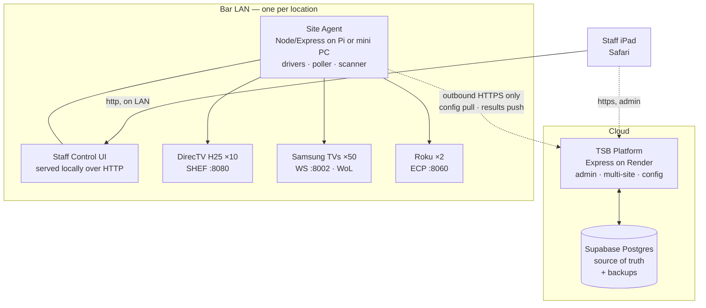

# Venue Control — Design Specification

**Module:** `venue-control` within `bar-ops-platform`
**Status:** Specification / pre-implementation
**Last updated:** 2026-09-02

Control of DirecTV receivers, Samsung TVs, and other headend sources across
multiple bar locations, from an iPad on-site or from TSB Platform remotely.

---

## 1. Purpose

Each location runs a headend of AV sources modulated onto a QAM cable plant.
Every TV in the building can tune any source. Today, staff change what's on a
DirecTV receiver using the DirecTV for Business app, and change TV power/input
using the SmartThings app — two separate apps, neither of which knows about the
other, and neither of which speaks the language staff actually use.

This module replaces both with one interface that understands the whole room.

### Goals

- One app, deployed identically at every location. Only the device data differs.
- Change what's playing on any source; change what any TV is showing.
- Discrete TV power on/off, manual and scheduled.
- Owner/admin discovery + diagnostics tool that inventories the network and
  reports exactly which control methods each device supports.
- Full config backed up and restorable by `site_id`, so a dead agent box is
  replaced in minutes rather than rebuilt from memory.

### Non-goals

- **No IR control.** Explicitly excluded. Network control only.
- No DVR/recording features (the H25 is not a DVR).
- No guest-facing interface.
- No control of the QAM modulator itself (v1 — see §14).

---

## 2. The physical system

Verified at the first location, 2026-09-02.

### Headend

Sixteen sources feed a VeCoax modulator, broadcast over the existing coax
distribution to roughly 50 TVs. There are **no zones on the source side** — the
plant is flat, and any TV can tune any source.

| QAM channel | Slot | Source                    |
|-------------|------|---------------------------|
| 10.1 – 19.1 | 10–19| DirecTV H25 receivers (10)|
| 20.1 – 21.1 | 20–21| Roku 1–2                  |
| 22.1        | 22   | Cornhole scoreboard (Pi)  |
| 23.1 – 25.1 | 23–25| Spare                     |

TVs are programmed with these 16 channels. Selecting a source on a TV means
tuning that TV to the corresponding QAM channel.

### DirecTV receivers — CONFIRMED WORKING

Receivers are on the main LAN (`192.168.1.0/24`) via a broadband DECA bridge.
The H25 has DECA built in, so each receiver pulls a DHCP address over coax.

SHEF (Set-top HTTP Export Functionality) is live on port 8080 with **External
Device access already enabled** — no 403, no commercial-firmware lockdown.

Sample from `192.168.1.90`:

```json
{
  "accessCardId": "0027-6187-7865",
  "receiverId": "0368 0879 2810",
  "stbSoftwareVersion": "0xfaa",
  "systemTime": 1788372505,
  "version": "1.12",
  "status": { "code": 200, "commandResult": 0, "msg": "OK.",
              "query": "/info/getVersion" }
}
```

`/info/getOptions` returned the complete supported command set:

| Endpoint                 | Purpose                                              |
|--------------------------|------------------------------------------------------|
| `/info/getVersion`       | Handshake; receiver ID, card ID, software version    |
| `/info/getSerialNum`     | Stable hardware identity                             |
| `/info/getLocations`     | Whole-home client list                               |
| `/info/mode`             | Active vs. standby                                   |
| `/tv/getTuned`           | Current channel and program on this box              |
| `/tv/getProgInfo`        | Program info for **any** channel, without tuning     |
| `/tv/tune`               | Direct channel change (`major`, opt. `minor`/`source`)|
| `/remote/processKey`     | Any remote button (`key`, opt. `hold`)               |
| `/serial/processCommand` | Legacy hex passthrough — unused                      |

Two findings that shape the design:

1. **Every command accepts a `callback` parameter.** SHEF supports JSONP, so a
   browser on the LAN can read responses cross-origin without a proxy. We don't
   rely on this (see §4) but it's a useful fallback and makes debugging easy.
2. **`/tv/getProgInfo` reads any channel without tuning to it.** This gives us
   live program titles for the favorites grid — "ESPN — Chiefs vs. Bills"
   instead of "ESPN" — sourced from the receivers themselves, with no
   third-party guide subscription.

### TVs

Roughly 50, predominantly Samsung, currently managed through SmartThings. Most
have Wake-on-LAN and/or mobile wake enabled. The owner is comfortable accepting
the one-time "allow this device" pairing prompt.

**Network topology is unconfirmed.** SmartThings is a cloud service, so the fact
that the same iPad controls both receivers and TVs does *not* establish that
they share a subnet. The discovery tool (§9) resolves this on first run.

---

## 3. Architecture

Hybrid: cloud is the source of truth, an on-site agent does the work, and the
staff UI is served locally so it survives an internet outage.



### Why an on-site agent exists

Recorded here so it isn't relitigated later.

Render runs in Oregon. `192.168.1.90` is a private, non-routable address — every
building has one, and it means nothing outside the building. No Render setting,
firewall rule, or DNS entry changes that.

The iPad *is* on the bar LAN, so the browser could in principle reach the
receivers directly. But TSB Platform is served over HTTPS, and browsers block
HTTPS pages from making plain-HTTP requests to local addresses. iOS enforces
this strictly. That kills the JSONP path from a cloud-hosted page.

Rejected alternatives:

- **Port-forwarding receivers to the internet.** SHEF has *no authentication
  whatsoever*. Anyone who found the address would control every TV in the bar.
  Never do this.
- **VPN from Render into the bar.** Requires a VPN endpoint device on-site —
  the same requirement in different clothing.
- **Cloudflare Tunnel / ngrok.** Also a daemon that runs on a machine on-site.

The requirement is narrow: **one always-on device on the bar LAN that can run
Node.** It does not have to be a Raspberry Pi. Valid hosts include the existing
cornhole Pi, an N100-class fanless mini PC (~$130), a NAS running Docker, or an
old laptop. It cannot be the Windows 7 rack PC — Node dropped Windows 7 support
years ago, and an unsupported OS shouldn't sit in the control path.

One more reason the agent is necessary: **Wake-on-LAN magic packets are LAN
broadcasts.** No cloud service can send one. TV wake requires an on-site sender
regardless of everything above.

### Why the staff UI is served locally

Render's free plan spins a service down after ~15 minutes idle, with a cold
start around 50 seconds. Acceptable for admin work. Unusable for a bartender
tapping "change channel" during a rush. Serving the staff UI from the agent
gives sub-100ms response and keeps the building running when the ISP doesn't.

### Responsibility split

| Concern                        | Cloud (TSB/Render) | Agent (on-site) |
|--------------------------------|:------------------:|:---------------:|
| Config source of truth         | ✅                  | cached mirror   |
| Multi-site admin               | ✅                  | —               |
| Backup snapshots               | ✅                  | pushes them     |
| Device discovery / scanning    | —                  | ✅               |
| Talking to receivers and TVs   | —                  | ✅               |
| Wake-on-LAN                    | —                  | ✅               |
| Staff control UI               | fallback view      | ✅ primary       |
| Schedules (fire the action)    | —                  | ✅               |
| Schedules (define them)        | ✅                  | executes         |
| Live device state polling      | —                  | ✅               |

### Cloud ↔ agent transport

The agent makes **outbound HTTPS only**. No inbound ports, no port forwarding,
nothing exposed. It authenticates with a per-site bearer token.

Because staff use the local UI, cloud→agent commands are rare (admin actions
only), so v1 uses simple polling rather than a persistent socket:

- Every 30s: `GET /api/venue/agent/config` with an `If-None-Match` etag. A 304
  means nothing changed and costs almost nothing.
- Every 30s: `POST /api/venue/agent/heartbeat` with status, version, device
  reachability summary.
- Every 5s while an admin session is active: `GET /api/venue/agent/commands`
  to pick up queued remote actions.
- On completion: `POST /api/venue/agent/results` for discovery runs, activity
  log batches, and command outcomes.

Upgrade path to a persistent WebSocket is noted in §14 but not needed for v1.

---

## 4. Repository layout

Follows existing `bar-ops-platform` conventions: Node/Express, vanilla HTML/CSS/JS
served from `public/`, one JS file per page, no build step.

```
bar-ops-platform/
├── docs/
│   └── venue-control.md          ← this file
├── routes/
│   └── venue/
│       ├── sites.js
│       ├── sources.js
│       ├── tvs.js
│       ├── favorites.js
│       ├── layouts.js
│       ├── schedules.js
│       ├── backups.js
│       └── agent.js              ← agent-facing endpoints
├── lib/
│   └── venue/
│       └── schema.sql
├── public/
│   └── venue/
│       ├── admin-sources.html / .js
│       ├── admin-tvs.html / .js
│       ├── admin-favorites.html / .js
│       ├── admin-discovery.html / .js
│       └── admin-backup.html / .js
└── agent/                        ← deployed to the on-site box
    ├── package.json
    ├── server.js
    ├── config.js
    ├── lib/
    │   ├── cache.js              ← SQLite mirror
    │   ├── sync.js               ← cloud pull/push
    │   ├── poller.js
    │   ├── scanner.js            ← discovery engine
    │   ├── oui.js                ← embedded MAC vendor table
    │   └── drivers/
    │       ├── directv.js
    │       ├── samsung-ws.js
    │       ├── samsung-st.js
    │       ├── wol.js
    │       └── roku.js
    └── public/                   ← staff control UI
        ├── index.html / app.js
        └── style.css
```

The agent has exactly three runtime dependencies: `express`, `better-sqlite3`,
and `ws`. Node 18+ provides `fetch` natively; WoL and the network scanner use
`dgram` and `net` from stdlib.

---

## 5. Data model

Postgres on Supabase. All tables prefixed `vc_` to avoid collision with existing
platform tables. Following existing convention: **RLS enabled, zero policies,
authorization enforced in Express route handlers.**

```sql
-- ============================================================
-- SITES & AGENTS
-- ============================================================

CREATE TABLE vc_sites (
  id                BIGSERIAL PRIMARY KEY,
  slug              TEXT NOT NULL UNIQUE,
  name              TEXT NOT NULL,
  timezone          TEXT NOT NULL DEFAULT 'America/Los_Angeles',
  scan_ranges       TEXT[] NOT NULL DEFAULT '{}',
  agent_token_hash  TEXT,
  enabled           BOOLEAN NOT NULL DEFAULT TRUE,
  notes             TEXT,
  created_at        TIMESTAMPTZ NOT NULL DEFAULT NOW(),
  updated_at        TIMESTAMPTZ NOT NULL DEFAULT NOW()
);

CREATE TABLE vc_agents (
  id            BIGSERIAL PRIMARY KEY,
  site_id       BIGINT NOT NULL REFERENCES vc_sites(id) ON DELETE CASCADE,
  hostname      TEXT,
  lan_ip        TEXT,
  agent_version TEXT,
  platform      TEXT,
  config_etag   TEXT,
  status        TEXT NOT NULL DEFAULT 'unknown',
  last_seen_at  TIMESTAMPTZ,
  created_at    TIMESTAMPTZ NOT NULL DEFAULT NOW()
);
CREATE INDEX ON vc_agents (site_id);

-- ============================================================
-- ZONES  (physical TV groupings; sources are deliberately flat)
-- ============================================================

CREATE TABLE vc_zones (
  id          BIGSERIAL PRIMARY KEY,
  site_id     BIGINT NOT NULL REFERENCES vc_sites(id) ON DELETE CASCADE,
  name        TEXT NOT NULL,
  sort_order  INT NOT NULL DEFAULT 0,
  created_at  TIMESTAMPTZ NOT NULL DEFAULT NOW(),
  UNIQUE (site_id, name)
);

-- ============================================================
-- SOURCES  (the 16 QAM slots)
-- ============================================================

CREATE TABLE vc_sources (
  id              BIGSERIAL PRIMARY KEY,
  site_id         BIGINT NOT NULL REFERENCES vc_sites(id) ON DELETE CASCADE,
  slot            INT NOT NULL,
  qam_channel     TEXT NOT NULL,
  label           TEXT NOT NULL,
  kind            TEXT NOT NULL DEFAULT 'directv',
  ip              INET,
  port            INT NOT NULL DEFAULT 8080,
  mac             MACADDR,
  receiver_id     TEXT,
  access_card_id  TEXT,
  serial_num      TEXT,
  sw_version      TEXT,
  enabled         BOOLEAN NOT NULL DEFAULT TRUE,
  sort_order      INT NOT NULL DEFAULT 0,
  notes           TEXT,
  created_at      TIMESTAMPTZ NOT NULL DEFAULT NOW(),
  updated_at      TIMESTAMPTZ NOT NULL DEFAULT NOW(),
  UNIQUE (site_id, slot),
  UNIQUE (site_id, qam_channel),
  CONSTRAINT vc_sources_kind_chk
    CHECK (kind IN ('directv','roku','static','spare')),
  CONSTRAINT vc_sources_directv_needs_ip
    CHECK (kind <> 'directv' OR ip IS NOT NULL)
);
CREATE INDEX ON vc_sources (site_id, enabled);
```

`kind` makes the table generic. A DirecTV receiver, a Roku, the cornhole
scoreboard, and an empty spare are all just slots on the plant — the driver
selected at runtime is what differs. Adding a source is a database row, never a
code change.

```sql
-- ============================================================
-- TVs
-- ============================================================

CREATE TABLE vc_tvs (
  id                  BIGSERIAL PRIMARY KEY,
  site_id             BIGINT NOT NULL REFERENCES vc_sites(id) ON DELETE CASCADE,
  zone_id             BIGINT REFERENCES vc_zones(id) ON DELETE SET NULL,
  name                TEXT NOT NULL,
  tag                 TEXT,
  brand               TEXT NOT NULL DEFAULT 'samsung',
  model               TEXT,
  ip                  INET,
  mac                 MACADDR,
  control_method      TEXT NOT NULL DEFAULT 'unknown',
  ws_port             INT,
  ws_token            TEXT,
  st_device_id        TEXT,
  wol_enabled         BOOLEAN NOT NULL DEFAULT FALSE,
  power_capable       BOOLEAN NOT NULL DEFAULT FALSE,
  channel_capable     BOOLEAN NOT NULL DEFAULT FALSE,
  volume_capable      BOOLEAN NOT NULL DEFAULT FALSE,
  default_source_slot INT,
  last_known_slot     INT,
  last_known_power    TEXT,
  last_contact_at     TIMESTAMPTZ,
  enabled             BOOLEAN NOT NULL DEFAULT TRUE,
  sort_order          INT NOT NULL DEFAULT 0,
  notes               TEXT,
  created_at          TIMESTAMPTZ NOT NULL DEFAULT NOW(),
  updated_at          TIMESTAMPTZ NOT NULL DEFAULT NOW(),
  CONSTRAINT vc_tvs_control_chk CHECK (control_method IN
    ('unknown','samsung_ws_token','samsung_ws_plain','samsung_legacy',
     'smartthings','wol_only','none')),
  CONSTRAINT vc_tvs_power_chk CHECK (last_known_power IS NULL
    OR last_known_power IN ('on','standby','off','unreachable'))
);
CREATE INDEX ON vc_tvs (site_id, enabled);
CREATE INDEX ON vc_tvs (site_id, zone_id);
CREATE UNIQUE INDEX ON vc_tvs (site_id, mac) WHERE mac IS NOT NULL;
```

The three `*_capable` flags are written by the discovery tool, not guessed. A TV
that can be powered but not tuned is a normal, supported state — the UI just
shows fewer buttons on it.

MAC is the stable identity, not IP. DHCP leases move; MACs don't.

```sql
-- ============================================================
-- FAVORITES  (site_id NULL = shared across all sites)
-- ============================================================

CREATE TABLE vc_favorites (
  id          BIGSERIAL PRIMARY KEY,
  site_id     BIGINT REFERENCES vc_sites(id) ON DELETE CASCADE,
  name        TEXT NOT NULL,
  major       INT NOT NULL,
  minor       INT,
  category    TEXT NOT NULL DEFAULT 'Sports',
  color       TEXT,
  sort_order  INT NOT NULL DEFAULT 0,
  enabled     BOOLEAN NOT NULL DEFAULT TRUE,
  created_at  TIMESTAMPTZ NOT NULL DEFAULT NOW(),
  CONSTRAINT vc_fav_major_chk CHECK (major BETWEEN 1 AND 9999)
);
CREATE INDEX ON vc_favorites (site_id, category, sort_order);
```

Local broadcast affiliates differ by market, so favorites are per-site by
default with `site_id NULL` available for national channels shared everywhere.

```sql
-- ============================================================
-- LAYOUTS  (whole-room presets)
-- ============================================================

CREATE TABLE vc_layouts (
  id          BIGSERIAL PRIMARY KEY,
  site_id     BIGINT NOT NULL REFERENCES vc_sites(id) ON DELETE CASCADE,
  name        TEXT NOT NULL,
  description TEXT,
  sort_order  INT NOT NULL DEFAULT 0,
  created_at  TIMESTAMPTZ NOT NULL DEFAULT NOW(),
  UNIQUE (site_id, name)
);

CREATE TABLE vc_layout_items (
  id           BIGSERIAL PRIMARY KEY,
  layout_id    BIGINT NOT NULL REFERENCES vc_layouts(id) ON DELETE CASCADE,
  target_type  TEXT NOT NULL,
  target_id    BIGINT NOT NULL,
  action       JSONB NOT NULL,
  step_order   INT NOT NULL DEFAULT 0,
  CONSTRAINT vc_layout_target_chk CHECK (target_type IN ('source','tv'))
);
CREATE INDEX ON vc_layout_items (layout_id, step_order);
```

A layout captures the whole room in one record — what each receiver is tuned to
*and* what each TV is showing. Example items:

```json
{ "target_type": "source", "target_id": 4,  "action": { "op": "tune", "major": 212 } }
{ "target_type": "tv",     "target_id": 17, "action": { "op": "power", "state": "on" } }
{ "target_type": "tv",     "target_id": 17, "action": { "op": "select_slot", "slot": 14 } }
```

```sql
-- ============================================================
-- SCHEDULES
-- ============================================================

CREATE TABLE vc_schedules (
  id            BIGSERIAL PRIMARY KEY,
  site_id       BIGINT NOT NULL REFERENCES vc_sites(id) ON DELETE CASCADE,
  name          TEXT NOT NULL,
  cron_expr     TEXT NOT NULL,
  action_type   TEXT NOT NULL,
  payload       JSONB NOT NULL DEFAULT '{}'::JSONB,
  enabled       BOOLEAN NOT NULL DEFAULT TRUE,
  last_run_at   TIMESTAMPTZ,
  last_result   TEXT,
  created_at    TIMESTAMPTZ NOT NULL DEFAULT NOW(),
  CONSTRAINT vc_sched_action_chk CHECK (action_type IN
    ('tvs_power','apply_layout','source_tune'))
);
CREATE INDEX ON vc_schedules (site_id, enabled);
```

Cron is evaluated by the agent in the site's own timezone, so open/close times
follow DST without intervention. Typical rows: all TVs on at 10:45, all off at
01:30, Sunday NFL layout at 09:50.

```sql
-- ============================================================
-- DISCOVERY
-- ============================================================

CREATE TABLE vc_discovery_runs (
  id           BIGSERIAL PRIMARY KEY,
  site_id      BIGINT NOT NULL REFERENCES vc_sites(id) ON DELETE CASCADE,
  started_at   TIMESTAMPTZ NOT NULL DEFAULT NOW(),
  finished_at  TIMESTAMPTZ,
  ranges       TEXT[] NOT NULL DEFAULT '{}',
  host_count   INT,
  summary      JSONB,
  started_by   TEXT
);
CREATE INDEX ON vc_discovery_runs (site_id, started_at DESC);

CREATE TABLE vc_discovery_devices (
  id              BIGSERIAL PRIMARY KEY,
  run_id          BIGINT NOT NULL REFERENCES vc_discovery_runs(id) ON DELETE CASCADE,
  ip              INET NOT NULL,
  mac             MACADDR,
  oui_vendor      TEXT,
  hostname        TEXT,
  open_ports      INT[] NOT NULL DEFAULT '{}',
  classified_as   TEXT NOT NULL DEFAULT 'unknown',
  confidence      TEXT NOT NULL DEFAULT 'low',
  identity        JSONB NOT NULL DEFAULT '{}'::JSONB,
  control_methods JSONB NOT NULL DEFAULT '[]'::JSONB,
  test_results    JSONB NOT NULL DEFAULT '{}'::JSONB,
  adopted_type    TEXT,
  adopted_id      BIGINT
);
CREATE INDEX ON vc_discovery_devices (run_id);

-- ============================================================
-- ACTIVITY LOG
-- ============================================================

CREATE TABLE vc_activity (
  id           BIGSERIAL PRIMARY KEY,
  site_id      BIGINT NOT NULL REFERENCES vc_sites(id) ON DELETE CASCADE,
  ts           TIMESTAMPTZ NOT NULL DEFAULT NOW(),
  actor        TEXT,
  origin       TEXT NOT NULL DEFAULT 'local',
  action       TEXT NOT NULL,
  target_type  TEXT,
  target_id    BIGINT,
  detail       JSONB NOT NULL DEFAULT '{}'::JSONB,
  result       TEXT NOT NULL DEFAULT 'ok'
);
CREATE INDEX ON vc_activity (site_id, ts DESC);

-- ============================================================
-- BACKUPS
-- ============================================================

CREATE TABLE vc_backups (
  id          BIGSERIAL PRIMARY KEY,
  site_id     BIGINT NOT NULL REFERENCES vc_sites(id) ON DELETE CASCADE,
  kind        TEXT NOT NULL DEFAULT 'auto',
  label       TEXT,
  payload     JSONB NOT NULL,
  checksum    TEXT NOT NULL,
  item_counts JSONB NOT NULL DEFAULT '{}'::JSONB,
  created_by  TEXT,
  created_at  TIMESTAMPTZ NOT NULL DEFAULT NOW(),
  CONSTRAINT vc_backups_kind_chk CHECK (kind IN ('auto','manual','pre_restore'))
);
CREATE INDEX ON vc_backups (site_id, created_at DESC);
```

---

## 6. Backup and disaster recovery

The requirement: an agent box dies, you plug in a replacement, log in, and
restore by `site_id` in minutes.

**The agent holds no unique state.** Everything it needs — sources, TVs, zones,
favorites, layouts, schedules, pairing tokens — lives in Supabase and is
mirrored into a local SQLite cache purely for offline operation. A dead agent
loses nothing.

### Snapshots

- Agent pushes a full snapshot nightly (`kind='auto'`), and any admin can
  trigger one on demand (`kind='manual'`).
- A `pre_restore` snapshot is taken automatically before any restore, so a
  restore is itself reversible.
- Retention: keep 30 auto, all manual, all pre_restore.
- `checksum` is SHA-256 over canonicalized payload JSON, so a corrupt or
  truncated snapshot is rejected rather than restored.

Snapshot payload shape:

```json
{
  "schema_version": 1,
  "site": { "slug": "main-st", "name": "Main Street", "timezone": "America/Los_Angeles" },
  "zones": [],
  "sources": [],
  "tvs": [],
  "favorites": [],
  "layouts": [],
  "layout_items": [],
  "schedules": []
}
```

### Replacement procedure

1. Install Node on the new box; copy the `agent/` directory to it.
2. Create `.env` with `SITE_SLUG`, `AGENT_TOKEN`, `CLOUD_URL`.
3. `npm install && npm start`.
4. Agent registers, pulls config, rebuilds its local cache. Operational.
5. **Samsung `ws_token` values survive**, because they're stored per-TV in the
   database, not on the agent box. No re-pairing walk-around.

Target: under ten minutes, no re-inventory, no re-pairing.

### Restore

`POST /api/venue/sites/:id/restore` with a `backup_id`. Takes a `pre_restore`
snapshot, then replaces zones/sources/tvs/favorites/layouts/schedules for that
site inside a transaction. Matching is by natural key (`slot` for sources, `mac`
for TVs) so IDs staying stable isn't required. Activity log and discovery
history are never touched by a restore.

---

## 7. Device drivers

Each driver exposes the same shape so the control layer stays generic:
`identify()`, `getState()`, and a set of capability methods.

### 7.1 DirecTV — `drivers/directv.js`

Plain HTTP GET to port 8080. Verified working.

```
GET /info/getVersion
GET /info/mode
GET /tv/getTuned
GET /tv/getProgInfo?major=206
GET /tv/tune?major=206
GET /remote/processKey?key=guide&hold=keyPress
```

Behavioral rules learned from the protocol:

- **SHEF is single-threaded.** Requests to one receiver must be serialized with
  a ~350ms minimum gap. Bursts cause hangs, not errors.
- **Different receivers are independent** and can be driven in parallel. "Tune
  all ten boxes" fans out fully — total time ≈ one receiver's latency.
- Use a 4-second timeout. A sleeping or rebooting receiver *hangs* rather than
  refusing, so timeouts matter more than error handling.
- Responses carry `status.code` inside a `200` body. Check the inner code, not
  just the HTTP status.
- `minor` is omitted for satellite channels.

Poller: every 15 seconds, staggered across receivers, calling `getTuned` and
`mode`. Results cached in memory and pushed to connected UIs.

### 7.2 Samsung TVs

Three paths, selected per TV by what discovery found. Capability-level fallback
is deliberate — power may go one route while channel goes another.

**`samsung_ws_token`** — modern Tizen, `TokenAuthSupport: true`.
`wss://<ip>:8002/api/v2/channels/samsung.remote.control?name=<b64>&token=<tok>`,
self-signed cert so certificate validation is disabled for these connections
only. First connection triggers the on-screen "allow this device" prompt; the
TV returns a token in the `ms.channel.connect` event, which we persist to
`vc_tvs.ws_token`. Sends remote key codes.

**`samsung_ws_plain`** — older Tizen, `TokenAuthSupport: false`. Same protocol
over `ws://<ip>:8001`, no token, no prompt.

**`samsung_legacy`** — pre-2016, port 55000, different handshake. Supported only
if discovery finds any.

**`smartthings`** — cloud REST, `https://api.smartthings.com/v1`, Bearer PAT.
Genuinely good at discrete power (`switch`/`on`, `switch`/`off` — a real
discrete command, not a toggle) and volume. Weak and inconsistent at tuning the
built-in cable tuner to a sub-channel. Used as the power fallback and never as
the primary channel path.

**`wol`** — magic packet to `vc_tvs.mac`, UDP broadcast on port 9. The only way
to wake a fully powered-down TV. Requires the agent (LAN broadcast).

#### Discrete power

Genuinely discrete, per the Plan B requirement:

```
POWER ON:
  1. Read PowerState from http://<ip>:8001/api/v2/
  2. Already on?          → done, no-op
  3. WoL enabled?         → send magic packet, wait 3s, re-read state
  4. Still off + ST?      → SmartThings switch/on
  5. Verify; report actual result

POWER OFF:
  1. Read PowerState
  2. Already standby/off? → done, no-op
  3. WS available?        → send KEY_POWER (verified against read state)
  4. Else ST?             → SmartThings switch/off
  5. Verify; report actual result
```

Reading state first is what makes a toggle behave discretely. Every power
operation reports what actually happened, not what was attempted — "all on"
must never silently turn a TV off.

Bulk operations run with concurrency 4 and return a per-TV result table.

#### Channel selection (stretch goal)

QAM channel `12.1` is sent as remote key codes exactly as a person would press
them: `KEY_1`, `KEY_2`, `KEY_MINUS`, `KEY_1`, `KEY_ENTER`, with ~200ms between
keys. This works wherever the physical remote works, which is the appeal.

Requires the TV on the Cable/Antenna input with the QAM channel list already
programmed — which is already true, since staff use these channels today.

Marked stretch because it is unverified. §9 tests it.

### 7.3 Roku — `drivers/roku.js`

ECP on port 8060 — a clean, documented, local REST API. Nearly free to
implement.

```
GET  /query/device-info
GET  /query/apps
POST /keypress/Home
POST /launch/<appId>
```

---

## 8. API surface

### 8.1 Cloud — TSB Platform

Admin-authenticated, mounted at `/api/venue`.

```
GET    /api/venue/sites
POST   /api/venue/sites
PATCH  /api/venue/sites/:id
GET    /api/venue/sites/:id/status          → agent health, device reachability

GET    /api/venue/sites/:id/zones
POST   /api/venue/sites/:id/zones
PATCH  /api/venue/zones/:id
DELETE /api/venue/zones/:id

GET    /api/venue/sites/:id/sources
POST   /api/venue/sites/:id/sources
PATCH  /api/venue/sources/:id
DELETE /api/venue/sources/:id

GET    /api/venue/sites/:id/tvs
POST   /api/venue/sites/:id/tvs
PATCH  /api/venue/tvs/:id
DELETE /api/venue/tvs/:id
POST   /api/venue/tvs/reorder

GET    /api/venue/sites/:id/favorites
POST   /api/venue/sites/:id/favorites
PATCH  /api/venue/favorites/:id
DELETE /api/venue/favorites/:id
POST   /api/venue/favorites/reorder         → { "ordered_ids": [12,7,3,...] }

GET    /api/venue/sites/:id/layouts
POST   /api/venue/sites/:id/layouts
PATCH  /api/venue/layouts/:id
DELETE /api/venue/layouts/:id
POST   /api/venue/layouts/:id/capture       → snapshot current room state

GET    /api/venue/sites/:id/schedules
POST   /api/venue/sites/:id/schedules
PATCH  /api/venue/schedules/:id
DELETE /api/venue/schedules/:id

GET    /api/venue/sites/:id/backups
POST   /api/venue/sites/:id/backups         → take snapshot now
GET    /api/venue/backups/:id               → full payload for download
POST   /api/venue/sites/:id/restore         → { "backup_id": 42 }

GET    /api/venue/sites/:id/discovery/runs
GET    /api/venue/discovery/runs/:id
GET    /api/venue/sites/:id/activity?limit=200
```

Agent-facing, authenticated by per-site bearer token:

```
POST   /api/venue/agent/register            → { site_slug, hostname, version, lan_ip }
GET    /api/venue/agent/config              → full site config; supports ETag/304
POST   /api/venue/agent/heartbeat
GET    /api/venue/agent/commands            → queued remote actions
POST   /api/venue/agent/results             → command outcomes, activity batches
POST   /api/venue/agent/discovery           → completed run + devices
POST   /api/venue/agent/backup              → nightly snapshot
```

### 8.2 Agent — local

Served on the LAN, default port 8088.

```
GET    /api/status                          → agent health, cloud sync, uptime

GET    /api/sources                         → all slots + live tuned state
POST   /api/sources/:slot/tune              → { "major": 206, "minor": null }
POST   /api/sources/:slot/key               → { "key": "guide", "hold": "keyPress" }
POST   /api/sources/bulk/tune               → { "slots": [10,11], "major": 212 }
GET    /api/sources/:slot/proginfo?major=   → what's on a channel, no tuning

GET    /api/tvs                             → all TVs + last known state
POST   /api/tvs/:id/power                   → { "state": "on" | "off" }
POST   /api/tvs/:id/slot                    → { "slot": 14 }
POST   /api/tvs/:id/volume                  → { "op": "up"|"down"|"mute" }
POST   /api/tvs/bulk/power                  → { "state":"off", "zone_id":3 }
POST   /api/tvs/bulk/slot                   → { "slot":12, "tv_ids":[1,4,9] }

GET    /api/guide                           → live titles for all favorites
POST   /api/layouts/:id/apply
GET    /api/layouts

POST   /api/discovery/scan                  → see §9
GET    /api/discovery/runs/:id
POST   /api/discovery/test                  → see §9
POST   /api/discovery/pair                  → { "ip": "..." }
POST   /api/discovery/adopt                 → see §9

POST   /api/sync/pull                       → force config refresh
POST   /api/backup/now
POST   /api/restore                         → { "backup_id": 42 }
```

Admin-scoped routes (`/api/discovery/*`, `/api/backup/*`, `/api/restore`)
require the admin PIN. Staff routes require the staff PIN.

---

## 9. Discovery & Diagnostics tool

**Owner/admin only.** This is the setup and troubleshooting tool, and it is the
first feature built — it answers the open questions about network topology and
TV control methods empirically, and it proves the agent architecture end to end.

Runs server-side on the agent (a browser cannot scan a subnet), driven from the
iPad.

### 9.1 Scan

`POST /api/discovery/scan` — `{ "ranges": ["192.168.1.0/24"], "deep": false }`

Ranges default to every subnet the agent's own interfaces are on. Additional
CIDRs can be supplied — important for confirming whether TVs sit on a separate
IoT or guest network.

Six passes:

1. **Announce** — SSDP `M-SEARCH` (`ssdp:all`) plus mDNS queries. Fast (~3s) and
   both Samsung and Roku announce themselves, so most devices appear before any
   sweeping starts.
2. **Sweep** — TCP connect across the range, concurrency 64, 400ms timeout, on
   ports `8080, 8001, 8002, 8060, 9197, 55000, 7676, 80, 443, 22`.
3. **Interrogate** — identity probes against whatever answered:
   - `:8080/info/getVersion` → DirecTV. Follow with `getSerialNum`, `getTuned`,
     `mode`, `getOptions`.
   - `:8001/api/v2/` → Samsung. Returns `name`, `modelName`, `wifiMac`,
     `networkType`, `PowerState`, and **`TokenAuthSupport`**.
   - `:8060/query/device-info` → Roku.
   - `:55000` reachable without `:8001` → legacy Samsung.
4. **Identify** — read the ARP table for MACs, resolve vendor via an embedded
   OUI table (Samsung, Roku, Raspberry Pi Foundation, LG, Vizio, TCL, DirecTV).
   A TV that's asleep and answering nothing still surfaces as a Samsung.
5. **Classify** — assign `classified_as` and a `confidence` of high (identity
   endpoint answered), medium (port signature + OUI agree), or low (OUI only).
6. **Report** — build the per-device `control_methods` array.

`TokenAuthSupport` is the single field that answers "what does this TV speak."
It distinguishes token WebSocket from plain WebSocket automatically, per TV,
with no manual testing.

Example device record:

```json
{
  "ip": "192.168.1.147",
  "mac": "a4:6c:f1:22:33:44",
  "oui_vendor": "Samsung Electronics",
  "open_ports": [8001, 8002, 9197],
  "classified_as": "samsung_tv",
  "confidence": "high",
  "identity": {
    "name": "[TV] Main Bar Left",
    "modelName": "UN55TU8000",
    "networkType": "wired",
    "PowerState": "on",
    "TokenAuthSupport": "true"
  },
  "control_methods": [
    { "method": "samsung_ws_token", "port": 8002, "status": "available",
      "needs_pairing": true },
    { "method": "wol", "status": "available" },
    { "method": "smartthings", "status": "unmatched" }
  ]
}
```

The scan is entirely read-only. Nothing is changed, nothing is powered, no
channels move. Safe to run during service.

### 9.2 Test

`POST /api/discovery/test` — `{ "targets": ["192.168.1.147"], "test": "round_trip" }`

Targets accept a single IP, a list, a zone, or `"all"` — satisfying the
"separate operations for each TV or all TVs" requirement. Bulk runs sequentially
with concurrency 4 and returns a per-device result table.

| Test | Disruptive | What it does |
|------|:----------:|--------------|
| `identity`    | no  | Re-read identity endpoint; confirm reachable |
| `power_state` | no  | Read current power state |
| `round_trip`  | mild| Volume up, then immediately down. Proves command delivery with a visible but harmless change |
| `pair`        | no  | Open WS, trigger the on-screen prompt, capture and store the token |
| `wol`         | yes | Send magic packet, poll state for 15s |
| `power_cycle` | yes | Off, wait, on. Confirms discrete power both directions |
| `channel`     | yes | Tune to a given QAM channel, then ask for on-screen confirmation |

Disruptive tests require explicit confirmation in the UI and are blocked
entirely during configured business hours unless overridden.

Every result records the method used, latency, and the raw response, so a
failure is diagnosable rather than just red.

### 9.3 Adopt

`POST /api/discovery/adopt`

Turns a discovered device into a managed record, pre-filled from the scan, with
**name, ID, and zone assigned at adoption time** — the point at which you're
looking at the device and know what it is.

```json
{
  "run_id": 12,
  "device_id": 88,
  "as": "tv",
  "name": "Main Bar Left",
  "tag": "MB-01",
  "zone_id": 3,
  "control_method": "samsung_ws_token",
  "wol_enabled": true,
  "default_source_slot": 10
}
```

Adopting as a source instead:

```json
{
  "run_id": 12,
  "device_id": 91,
  "as": "source",
  "slot": 14,
  "qam_channel": "14.1",
  "label": "DirecTV 14",
  "kind": "directv"
}
```

Adoption writes through to Supabase, so a device catalogued at the bar is
immediately visible in TSB Platform.

Bulk adopt handles the common case: ten DirecTV receivers found, assign slots
10–19 in one action.

### 9.4 Health view

The same screen doubles as ongoing troubleshooting: every managed device with
last contact time, current state, which control method is in use, and its last
error. Re-scan compares against the managed inventory and flags **new** devices,
**missing** devices, and devices whose **IP has changed** — which is how you
catch a receiver that grabbed a new DHCP lease before staff report a black TV.

---

## 10. Staff control UI

Served locally by the agent. Vanilla JS, no build step, designed for an iPad
held at arm's length in a dark room. Large targets, high contrast, no hover
states, no dialogs in the fast path.

**Sources tab** — 16 tiles. Each shows QAM channel badge, label, current channel
callsign, and live program title from `getTuned`. Tap a tile → full-screen
picker: the favorites grid with live program titles from `getProgInfo`, plus a
keypad for anything not in favorites. A tile whose receiver isn't answering goes
grey and says "not responding" rather than showing a stale channel — silently
stale data destroys trust faster than a visible error.

**TVs tab** — grouped by zone. Each TV shows name, power state, and which source
it's on. Tap → the 16 sources with what's currently playing on each. Zone-level
and all-TV power controls at the top.

**Layouts tab** — saved room presets, one tap to apply, with a 15-second undo
bar rather than a confirmation dialog. Confirmation before the fact trains
people to tap through it; undo after the fact actually gets used.

Server holds the truth. The agent polls devices and pushes state to every
connected iPad, so three iPads and the manager's phone always agree — including
when someone walks up to the rack and changes a box by hand.

---

## 11. Security

- **Never expose the agent to the internet.** Bind to LAN interfaces only. No
  port forwarding, ever. SHEF has no authentication of any kind — a
  reachable-from-outside receiver is a reachable-by-anyone receiver.
- Agent → cloud is outbound HTTPS only, bearer token per site, stored hashed
  (`vc_sites.agent_token_hash`).
- Staff PIN for control routes; separate admin PIN for discovery, backup,
  restore, and configuration. Discovery is admin-only by design.
- SmartThings PAT stored as an agent environment variable in v1. If it moves to
  the database later it must be encrypted at rest — it grants control of every
  Samsung device on the account.
- `vc_tvs.ws_token` values are pairing secrets. They're per-TV and LAN-scoped,
  but treat them as credentials.
- All destructive admin actions write to `vc_activity` with actor and origin.
- Consistent with platform convention: RLS enabled with zero policies;
  authorization enforced in Express route handlers. All venue routes must check
  site membership explicitly — there is no database-level backstop.

---

## 12. Build order

Each phase is independently useful and shippable.

### Phase 0 — Agent skeleton
Registration, config pull, SQLite cache, heartbeat, local UI shell, admin PIN.
Proves the cloud↔agent path with nothing at risk.

### Phase 1 — Discovery & Diagnostics ← **build first**
The scanner, classification, test operations, adoption. Delivers the network
inventory, answers the TV-topology question, and determines the control method
for every TV. Everything downstream depends on what this finds.

### Phase 2 — Source control
DirecTV driver, poller, sources admin CRUD (receiver ID, card #, IP, QAM
channel), favorites CRUD with sort, staff Sources tab. This is the largest
single jump in day-to-day usefulness and carries essentially zero technical
risk — SHEF is already verified.

### Phase 3 — TV power
Discrete on/off with state verification, WoL, zones, bulk and per-zone
operations, schedules. The Plan B requirement, delivered.

### Phase 4 — TV source selection
QAM tuning via key codes. Gated on Phase 1 results. If it doesn't work reliably,
the app is still fully useful without it.

### Phase 5 — Layouts, backup, activity
Whole-room presets with capture-current-state, backup/restore UI, activity log.

### Phase 6 — Roku and spares
ECP driver, app launching, spare slot handling.

Multi-site rollout happens after Phase 2 is proven at one location. The agent
deploys identically; only `SITE_SLUG`, `AGENT_TOKEN`, and the device rows differ.

---

## 13. Deployment notes

Carried over from platform conventions:

- Git push from a Claude sandbox to `scottoroboto/bar-ops-platform` is blocked
  by the proxy. Updates go through GitHub's web upload UI.
- Render auto-deploy doesn't reliably fire; deploys are triggered manually via
  the Render API.
- **The agent does not deploy through Render.** It's copied to the on-site box
  and run there. Update path for v1 is manual (`git pull` or file copy, then
  restart). A self-update check against a version endpoint is a Phase 5+
  consideration.
- Agent should run under `systemd` (or `pm2`) with restart-on-failure and
  start-on-boot. A bar loses power; the agent must come back without anyone
  thinking about it.
- Set **DHCP reservations** for every receiver and every controlled TV before
  going live. The system tolerates IP changes because MAC is the stable
  identity, but reservations prevent a whole class of confusing failures.

---

## 14. Open questions

| # | Question | Blocks | Resolution |
|---|----------|--------|-----------|
| 1 | Agent host hardware — existing cornhole Pi, mini PC, or other? | Deployment, not development | Owner decision (currently paused). Development proceeds on any Node host. |
| 2 | Are TVs on the same subnet as receivers? | TV control architecture | Phase 1 scan answers definitively. |
| 3 | SmartThings PAT available? | ST fallback path | Owner generates from Samsung account when needed. |
| 4 | Exact receiver IPs and slot↔QAM mapping | Seeding source records | Phase 1 scan + bulk adopt. |
| 5 | Local broadcast affiliate channel numbers | Favorites seed | Market-specific; collect per site. |
| 6 | VeCoax model — does it expose an API? | Possible future feature | Read model plate. Some VeCoax units expose a web UI that could report modulator health or stream naming. |
| 7 | Do all three sites share a network design? | Multi-site rollout | Scan each site during rollout. |
| 8 | Persistent WebSocket for cloud→agent instead of polling | Remote control latency | Not needed for v1; staff use the local UI. Revisit if remote real-time control becomes a requirement. |

---

## 15. Decision log

| Decision | Rationale |
|----------|-----------|
| Hybrid architecture (cloud truth + on-site agent + local UI) | Cloud cannot route to private addresses; Render free tier cold-starts ~50s; WoL requires a LAN sender. Local UI keeps the bar running during an ISP outage. |
| **No IR control** | Explicit owner requirement. Network control only. |
| Discrete power as the TV control baseline | Best-supported operation across every available path; the reliable 80% with the least risk. |
| QAM tuning as a stretch goal | Unverified. The app is fully useful without it, so it must not be on the critical path. |
| Generic `vc_sources` table with `kind` | DirecTV, Roku, static, and spare are all slots on one plant. Adding a source is a row, never a code change. |
| MAC as stable device identity | DHCP leases move; MAC addresses don't. |
| Supabase as source of truth, agent as cache | Makes disaster recovery trivial — a dead agent loses nothing, and pairing tokens survive replacement. |
| Polling over WebSocket for cloud↔agent | Staff use the local UI, so cloud→agent commands are rare. Polling works through any NAT with no inbound ports. Upgradeable later. |
| Vanilla JS, no build step | Matches existing platform convention, and the system still runs in three years when nobody remembers the toolchain. |
| Discovery tool built first | Answers the remaining unknowns empirically and proves the agent architecture end to end before anything depends on it. |
